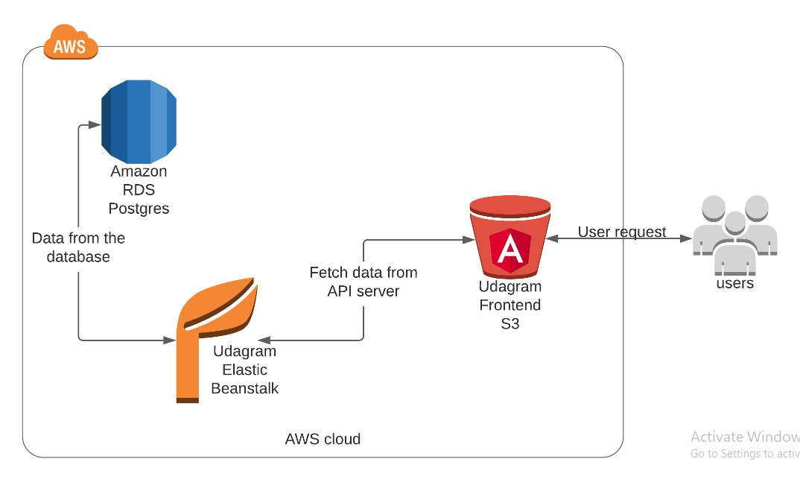

### Udagram infrastructure



## AWS Cloud Setup

- RDS - Database Host:udagram-api-dev.eba-9kbsy8nv.us-east-1.elasticbeanstalk.com
- RDS - Database Port: 5432
- RDS - Database Name: progres

- S3 Endpoint - Frontend: http://mayar-udagram.s3-website-us-east-1.amazonaws.com/home

- Elastic Beanstalk URL - Backend: http://udagram-api-dev.eba-9kbsy8nv.us-east-1.elasticbeanstalk.com/

## Environment Variables

Setup the following variables in the .env file or in the cloud environments:

```
- PORT                = 8080
- POSTGRES_HOST       = <Database_IP_Address>
- POSTGRES_PORT       = <Database_Port>
- POSTGRES_DB         = <Database_Name>
- POSTGRES_USERNAME   = <Database_Username>
- POSTGRES_PASSWORD   = <Database_Password>
- URL                 = <Url>
- JWT_SECRET          = <Any_PassPhrase>
- AWS_REGION          = <us-east-1>
- AWS_PROFILE         = <Profile>
- AWS_BUCKET          = <Bucket_Name>
```

#### How come the S3 Bucket Work ?

1. Receives Requests from the user And then send it to **Elastic Beanstalk**
2. Sends Back Responses from the **Elastic Beanstalk** to the User
3. Saves the Uploaded pictures .

#### How come the Elastic Beanstalk Work ?

1. Receives a Requests from the **S3 Buckets**
2. Sends Queries to the **RDS Postgres DB**
3. Sends Responses to the **Elastic Beanstalk**

#### How come the RDS Postgres DB Work ?

1. Receives Queries from **Elastic Beanstalk**
2. Sends Data to **Elastic Beanstalk**
